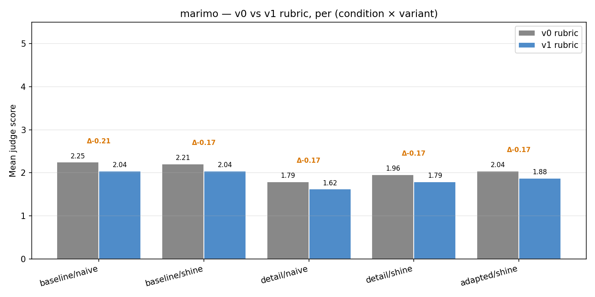
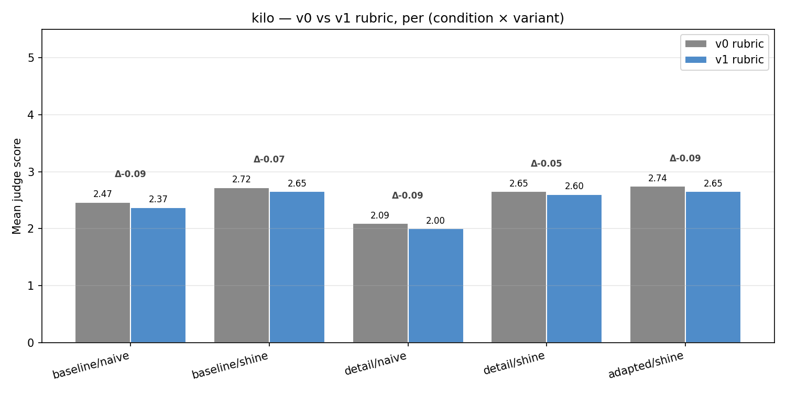
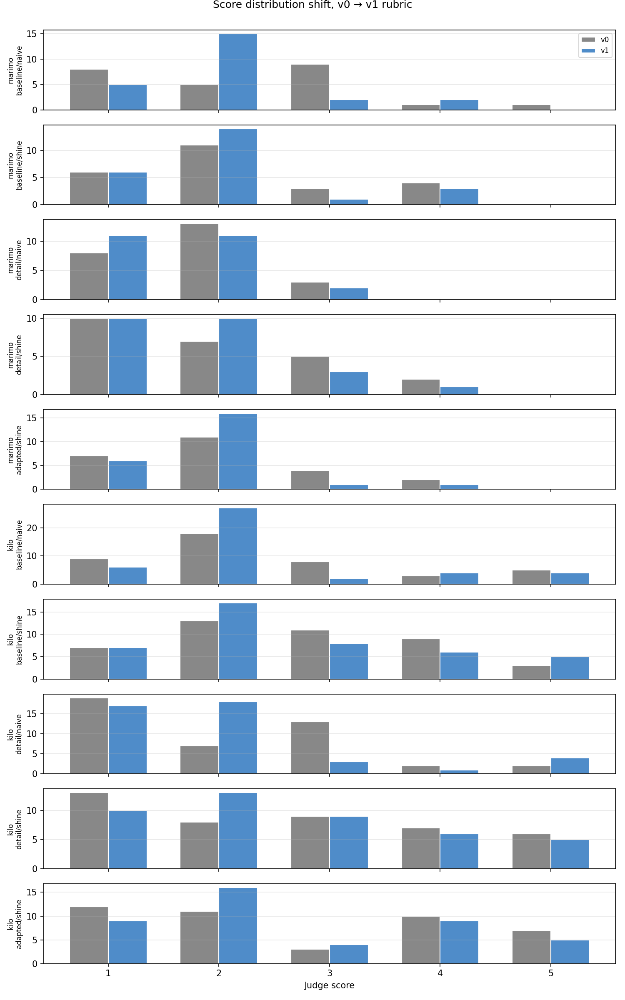

# Judge Rubric Impact — v0 vs v1

- v0 judgments: `judgments.jsonl`
- v1 judgments: `judgments_v1.jsonl`

## Headline: mean score per cell (v0 → v1)

| Repo | Variant | Condition | n | v0 mean | v1 mean | Δ |
|---|---|---|---:|---:|---:|---:|
| marimo | baseline | naive | 24 | 2.25 | 2.04 | -0.21 |
| marimo | baseline | in_context | 24 | 4.79 | 4.67 | -0.12 |
| marimo | baseline | shine | 24 | 2.21 | 2.04 | -0.17 |
| marimo | detail | naive | 24 | 1.79 | 1.62 | -0.17 |
| marimo | detail | shine | 24 | 1.96 | 1.79 | -0.17 |
| marimo | adapted | shine | 24 | 2.04 | 1.88 | -0.17 |
| kilo | baseline | naive | 43 | 2.47 | 2.37 | -0.09 |
| kilo | baseline | in_context | 43 | 4.86 | 4.86 | +0.00 |
| kilo | baseline | shine | 43 | 2.72 | 2.65 | -0.07 |
| kilo | detail | naive | 43 | 2.09 | 2.00 | -0.09 |
| kilo | detail | shine | 43 | 2.65 | 2.60 | -0.05 |
| kilo | adapted | shine | 43 | 2.74 | 2.65 | -0.09 |

### marimo

### kilo

## Score distribution shift

## Failure-mode taxonomy shift

Counts are over all rows scoring < 5. v1 introduces `no_specifics` (split out from `missing_information`).

| Repo | Variant | Condition | tag | v0 count | v1 count |
|---|---|---|---|---:|---:|
| marimo | baseline | naive | `missing_information` | 18 | 12 |
| marimo | baseline | naive | `no_specifics` | 0 | 15 |
| marimo | baseline | naive | `off_topic` | 3 | 1 |
| marimo | baseline | naive | `wrong_specifics` | 14 | 11 |
| marimo | baseline | shine | `missing_information` | 20 | 15 |
| marimo | baseline | shine | `no_specifics` | 0 | 11 |
| marimo | baseline | shine | `off_topic` | 5 | 1 |
| marimo | baseline | shine | `wrong_specifics` | 16 | 10 |
| marimo | detail | naive | `format_failure` | 3 | 3 |
| marimo | detail | naive | `missing_information` | 21 | 10 |
| marimo | detail | naive | `no_specifics` | 0 | 12 |
| marimo | detail | naive | `off_topic` | 5 | 6 |
| marimo | detail | naive | `other` | 0 | 1 |
| marimo | detail | naive | `wrong_specifics` | 20 | 14 |
| marimo | detail | shine | `missing_information` | 18 | 10 |
| marimo | detail | shine | `no_specifics` | 0 | 11 |
| marimo | detail | shine | `off_topic` | 7 | 4 |
| marimo | detail | shine | `refusal_or_nonresponse` | 1 | 1 |
| marimo | detail | shine | `wrong_specifics` | 11 | 10 |
| marimo | adapted | shine | `format_failure` | 1 | 0 |
| marimo | adapted | shine | `missing_information` | 20 | 13 |
| marimo | adapted | shine | `no_specifics` | 0 | 13 |
| marimo | adapted | shine | `off_topic` | 3 | 1 |
| marimo | adapted | shine | `refusal_or_nonresponse` | 1 | 2 |
| marimo | adapted | shine | `wrong_specifics` | 10 | 10 |
| kilo | baseline | naive | `missing_information` | 26 | 17 |
| kilo | baseline | naive | `no_specifics` | 0 | 20 |
| kilo | baseline | naive | `off_topic` | 6 | 3 |
| kilo | baseline | naive | `wrong_specifics` | 27 | 23 |
| kilo | baseline | shine | `format_failure` | 1 | 0 |
| kilo | baseline | shine | `missing_information` | 30 | 22 |
| kilo | baseline | shine | `no_specifics` | 0 | 10 |
| kilo | baseline | shine | `refusal_or_nonresponse` | 0 | 1 |
| kilo | baseline | shine | `wrong_specifics` | 25 | 21 |
| kilo | detail | naive | `format_failure` | 4 | 5 |
| kilo | detail | naive | `missing_information` | 26 | 15 |
| kilo | detail | naive | `no_specifics` | 0 | 19 |
| kilo | detail | naive | `off_topic` | 14 | 9 |
| kilo | detail | naive | `other` | 0 | 1 |
| kilo | detail | naive | `refusal_or_nonresponse` | 2 | 1 |
| kilo | detail | naive | `wrong_specifics` | 25 | 21 |
| kilo | detail | shine | `format_failure` | 1 | 1 |
| kilo | detail | shine | `missing_information` | 27 | 20 |
| kilo | detail | shine | `no_specifics` | 0 | 13 |
| kilo | detail | shine | `off_topic` | 6 | 5 |
| kilo | detail | shine | `refusal_or_nonresponse` | 1 | 0 |
| kilo | detail | shine | `wrong_specifics` | 25 | 19 |
| kilo | adapted | shine | `missing_information` | 27 | 14 |
| kilo | adapted | shine | `no_specifics` | 0 | 12 |
| kilo | adapted | shine | `off_topic` | 4 | 2 |
| kilo | adapted | shine | `wrong_specifics` | 26 | 26 |

## Per-QA score flips (|Δ| ≥ 1)

Useful for spot-checking — these are the QAs where the rubric change moved the score by at least 1 point.

| Repo | Variant | qa_id | cond | v0 | v1 | Δ |
|---|---|---|---|---:|---:|---:|
| marimo | baseline | `ai_mcp_pairing_ai_mcp_pairing_1_0001` | in_context | 4 | 3 | -1 |
| marimo | baseline | `ai_mcp_pairing_ai_mcp_pairing_1_0001` | naive | 1 | 2 | +1 |
| marimo | baseline | `ai_mcp_pairing_ai_mcp_pairing_1_0002` | naive | 3 | 2 | -1 |
| marimo | baseline | `ai_mcp_pairing_ai_mcp_pairing_1_0002` | shine | 2 | 1 | -1 |
| marimo | baseline | `ai_mcp_pairing_ai_mcp_pairing_1_0003` | shine | 3 | 2 | -1 |
| marimo | baseline | `apps_scripts_wasm_apps_scripts_wasm_1_0001` | naive | 1 | 2 | +1 |
| marimo | baseline | `apps_scripts_wasm_apps_scripts_wasm_1_0002` | naive | 3 | 2 | -1 |
| marimo | baseline | `overview_purpose_overview_purpose_1_0001` | in_context | 5 | 4 | -1 |
| marimo | baseline | `overview_purpose_overview_purpose_1_0002` | naive | 3 | 2 | -1 |
| marimo | baseline | `overview_purpose_overview_purpose_1_0002` | shine | 2 | 1 | -1 |
| marimo | baseline | `public_interface_public_interface_1_0001` | naive | 3 | 2 | -1 |
| marimo | baseline | `public_interface_public_interface_1_0002` | naive | 3 | 2 | -1 |
| marimo | baseline | `public_interface_public_interface_1_0002` | shine | 3 | 2 | -1 |
| marimo | baseline | `public_interface_public_interface_1_0003` | shine | 1 | 2 | +1 |
| marimo | baseline | `setup_cli_setup_cli_1_0001` | shine | 1 | 2 | +1 |
| marimo | baseline | `setup_cli_setup_cli_1_0002` | naive | 2 | 1 | -1 |
| marimo | baseline | `sql_data_integrations_sql_data_integrations_1_0001` | naive | 3 | 2 | -1 |
| marimo | baseline | `sql_data_integrations_sql_data_integrations_1_0002` | naive | 3 | 2 | -1 |
| marimo | baseline | `sql_data_integrations_sql_data_integrations_1_0003` | in_context | 5 | 4 | -1 |
| marimo | baseline | `sql_data_integrations_sql_data_integrations_1_0003` | naive | 1 | 2 | +1 |
| marimo | baseline | `sql_data_integrations_sql_data_integrations_1_0003` | shine | 4 | 3 | -1 |
| marimo | baseline | `ui_outputs_interactivity_ui_outputs_interactivity_1_0001` | in_context | 5 | 4 | -1 |
| marimo | baseline | `ui_outputs_interactivity_ui_outputs_interactivity_1_0001` | naive | 5 | 4 | -1 |
| marimo | baseline | `ui_outputs_interactivity_ui_outputs_interactivity_1_0001` | shine | 3 | 2 | -1 |
| marimo | baseline | `ui_outputs_interactivity_ui_outputs_interactivity_1_0002` | naive | 1 | 2 | +1 |
| marimo | baseline | `ui_outputs_interactivity_ui_outputs_interactivity_1_0003` | in_context | 4 | 5 | +1 |
| marimo | detail | `ai_mcp_pairing_ai_mcp_pairing_1_0002` | shine | 2 | 1 | -1 |
| marimo | detail | `ai_mcp_pairing_ai_mcp_pairing_1_0003` | shine | 3 | 2 | -1 |
| marimo | detail | `overview_purpose_overview_purpose_1_0002` | naive | 2 | 1 | -1 |
| marimo | detail | `overview_purpose_overview_purpose_1_0002` | shine | 1 | 2 | +1 |
| marimo | detail | `overview_purpose_overview_purpose_1_0003` | naive | 2 | 1 | -1 |
| marimo | detail | `public_interface_public_interface_1_0001` | naive | 3 | 2 | -1 |
| marimo | detail | `reactive_runtime_dataflow_reactive_runtime_dataflow_1_0002` | shine | 4 | 3 | -1 |
| marimo | detail | `setup_cli_setup_cli_1_0001` | shine | 1 | 2 | +1 |
| marimo | detail | `setup_cli_setup_cli_1_0002` | naive | 2 | 1 | -1 |
| marimo | detail | `sql_data_integrations_sql_data_integrations_1_0002` | shine | 3 | 2 | -1 |
| marimo | detail | `sql_data_integrations_sql_data_integrations_1_0003` | naive | 1 | 2 | +1 |
| marimo | detail | `sql_data_integrations_sql_data_integrations_1_0003` | shine | 2 | 1 | -1 |
| marimo | detail | `ui_outputs_interactivity_ui_outputs_interactivity_1_0001` | shine | 3 | 2 | -1 |
| marimo | detail | `ui_outputs_interactivity_ui_outputs_interactivity_1_0003` | naive | 2 | 1 | -1 |
| marimo | adapted | `ai_mcp_pairing_ai_mcp_pairing_1_0003` | shine | 3 | 2 | -1 |
| marimo | adapted | `overview_purpose_overview_purpose_1_0003` | shine | 3 | 2 | -1 |
| marimo | adapted | `public_interface_public_interface_1_0003` | shine | 1 | 2 | +1 |
| marimo | adapted | `reactive_runtime_dataflow_reactive_runtime_dataflow_1_0002` | shine | 4 | 3 | -1 |
| marimo | adapted | `sql_data_integrations_sql_data_integrations_1_0001` | shine | 3 | 2 | -1 |
| marimo | adapted | `ui_outputs_interactivity_ui_outputs_interactivity_1_0001` | shine | 3 | 2 | -1 |
| kilo | baseline | `overview_purpose_overview_purpose_1_0002` | naive | 1 | 2 | +1 |
| kilo | baseline | `overview_purpose_overview_purpose_1_0004` | naive | 4 | 5 | +1 |
| kilo | baseline | `overview_purpose_overview_purpose_1_0005` | shine | 4 | 3 | -1 |
| kilo | baseline | `overview_purpose_overview_purpose_1_0006` | naive | 1 | 2 | +1 |
| kilo | baseline | `overview_purpose_overview_purpose_1_0007` | shine | 4 | 5 | +1 |
| kilo | baseline | `overview_purpose_overview_purpose_1_0008` | naive | 3 | 2 | -1 |
| kilo | baseline | `overview_purpose_overview_purpose_1_0009` | naive | 3 | 2 | -1 |
| kilo | baseline | `overview_purpose_overview_purpose_1_0010` | naive | 1 | 2 | +1 |
| kilo | baseline | `overview_purpose_overview_purpose_1_0013` | shine | 3 | 2 | -1 |
| kilo | baseline | `overview_purpose_overview_purpose_1_0014` | naive | 3 | 2 | -1 |
| kilo | baseline | `overview_purpose_overview_purpose_1_0014` | shine | 3 | 2 | -1 |
| kilo | baseline | `overview_purpose_overview_purpose_1_0016` | shine | 3 | 2 | -1 |
| kilo | baseline | `raw_terminal_input_1_0001` | naive | 5 | 4 | -1 |
| kilo | baseline | `raw_terminal_input_1_0002` | naive | 3 | 2 | -1 |
| kilo | baseline | `raw_terminal_input_1_0008` | naive | 2 | 1 | -1 |
| kilo | baseline | `raw_terminal_input_1_0009` | shine | 2 | 1 | -1 |
| kilo | baseline | `raw_terminal_input_1_0010` | naive | 3 | 2 | -1 |
| kilo | baseline | `raw_terminal_input_1_0010` | shine | 3 | 2 | -1 |
| kilo | baseline | `raw_terminal_input_1_0013` | shine | 4 | 5 | +1 |
| kilo | baseline | `rows_editing_persistence_1_0002` | shine | 3 | 2 | -1 |
| kilo | baseline | `rows_editing_persistence_1_0003` | naive | 1 | 2 | +1 |
| kilo | baseline | `rows_editing_persistence_1_0006` | naive | 3 | 2 | -1 |
| kilo | baseline | `rows_editing_persistence_1_0007` | shine | 1 | 2 | +1 |
| kilo | baseline | `rows_editing_persistence_1_0009` | naive | 5 | 4 | -1 |
| kilo | baseline | `rows_editing_persistence_1_0009` | shine | 2 | 3 | +1 |
| kilo | detail | `overview_purpose_overview_purpose_1_0004` | naive | 1 | 2 | +1 |
| kilo | detail | `overview_purpose_overview_purpose_1_0011` | shine | 4 | 3 | -1 |
| kilo | detail | `overview_purpose_overview_purpose_1_0013` | naive | 3 | 2 | -1 |
| kilo | detail | `overview_purpose_overview_purpose_1_0014` | naive | 3 | 2 | -1 |
| kilo | detail | `raw_terminal_input_1_0001` | naive | 3 | 2 | -1 |
| kilo | detail | `raw_terminal_input_1_0002` | naive | 3 | 2 | -1 |
| kilo | detail | `raw_terminal_input_1_0004` | shine | 1 | 2 | +1 |
| kilo | detail | `raw_terminal_input_1_0005` | naive | 3 | 2 | -1 |
| kilo | detail | `raw_terminal_input_1_0005` | shine | 1 | 2 | +1 |
| kilo | detail | `raw_terminal_input_1_0007` | naive | 4 | 5 | +1 |
| kilo | detail | `raw_terminal_input_1_0009` | shine | 2 | 1 | -1 |
| kilo | detail | `raw_terminal_input_1_0010` | naive | 3 | 2 | -1 |
| kilo | detail | `raw_terminal_input_1_0010` | shine | 3 | 2 | -1 |
| kilo | detail | `raw_terminal_input_1_0012` | naive | 1 | 2 | +1 |
| kilo | detail | `raw_terminal_input_1_0013` | shine | 5 | 4 | -1 |
| kilo | detail | `raw_terminal_input_1_0014` | naive | 3 | 2 | -1 |
| kilo | detail | `raw_terminal_input_1_0014` | shine | 1 | 2 | +1 |
| kilo | detail | `rows_editing_persistence_1_0002` | naive | 3 | 5 | +2 |
| kilo | detail | `rows_editing_persistence_1_0003` | naive | 3 | 2 | -1 |
| kilo | detail | `rows_editing_persistence_1_0004` | shine | 4 | 3 | -1 |
| kilo | detail | `rows_editing_persistence_1_0005` | shine | 3 | 2 | -1 |
| kilo | detail | `rows_editing_persistence_1_0008` | naive | 3 | 2 | -1 |
| kilo | detail | `rows_editing_persistence_1_0011` | shine | 1 | 2 | +1 |
| kilo | adapted | `overview_purpose_overview_purpose_1_0001` | shine | 5 | 4 | -1 |
| kilo | adapted | `overview_purpose_overview_purpose_1_0004` | shine | 2 | 1 | -1 |
| kilo | adapted | `overview_purpose_overview_purpose_1_0008` | shine | 4 | 3 | -1 |
| kilo | adapted | `overview_purpose_overview_purpose_1_0009` | shine | 1 | 2 | +1 |
| kilo | adapted | `overview_purpose_overview_purpose_1_0011` | shine | 4 | 3 | -1 |
| kilo | adapted | `raw_terminal_input_1_0004` | shine | 1 | 2 | +1 |
| kilo | adapted | `raw_terminal_input_1_0010` | shine | 3 | 2 | -1 |
| kilo | adapted | `raw_terminal_input_1_0012` | shine | 1 | 2 | +1 |
| kilo | adapted | `rows_editing_persistence_1_0001` | shine | 3 | 2 | -1 |
| kilo | adapted | `rows_editing_persistence_1_0002` | shine | 4 | 3 | -1 |
| kilo | adapted | `rows_editing_persistence_1_0007` | shine | 1 | 2 | +1 |
| kilo | adapted | `rows_editing_persistence_1_0009` | shine | 5 | 4 | -1 |
